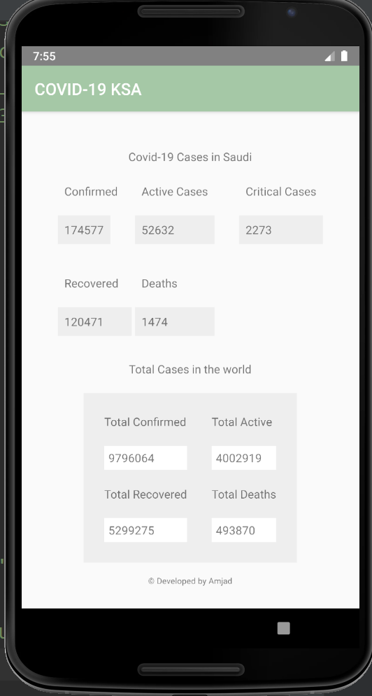

# AndroidApp_COVID19_KSA

Covid-19 ksa provide latest covid-19 cases in Saudi Arabia and total cases around the world.



___

##Dependencies

```
    implementation 'com.squareup.okhttp3:okhttp:3.14.9'
    implementation 'com.squareup.retrofit2:retrofit:2.9.0'
    implementation 'com.google.code.gson:gson:2.8.6'
    implementation 'com.squareup.retrofit2:converter-gson:2.6.0'
    implementation 'com.squareup.okhttp3:logging-interceptor:3.6.0'
```

___

###Api 

1. [COVID-19](https://rapidapi.com/api-sports/api/covid-193) : Get statistics for all countries about COVID-19 [FREE TO USE]


